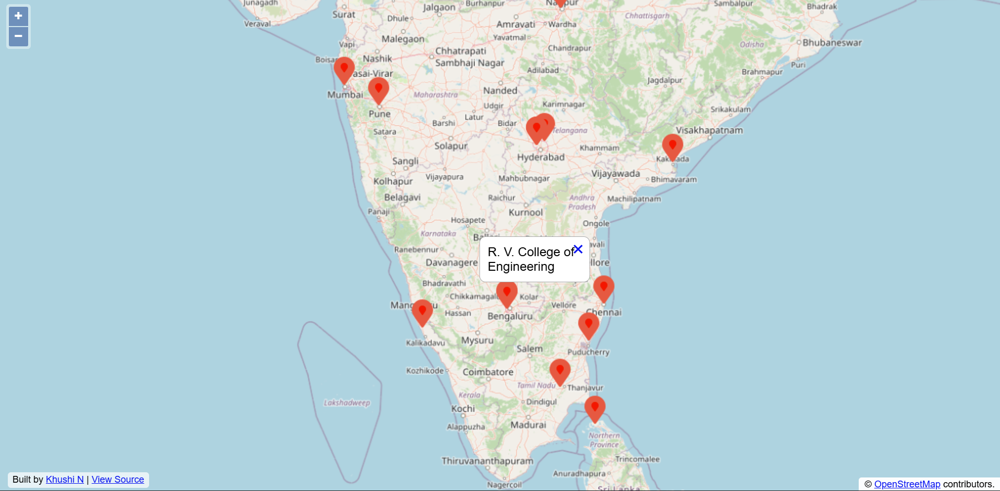

# Interactive Map with OpenLayers + OpenStreetMap

This project creates an interactive map using **OpenLayers** with data from **OpenStreetMap contributors**.  
Markers are loaded from a generated JavaScript file (eg, [where.js](./where.js) or [sample_where.js](./sample_where.js)) containing latitude, longitude, and name data.  
You can either load the **sample data** to see a quick demo or **geocode your own addresses** to visualize them on the map.

---

## Demo

Quick preview of the map using sample data:



Open it yourself in a browser:
```
where.html?data=sample_where.js
```

---

## Features
- Fullscreen interactive map
- Uses OpenStreetMap tiles (with required attribution)
- Custom marker icons
- Popup info when clicking a marker
- Python scripts to geocode addresses ([geoload.py](./geoload.py)) and generate marker data ([geodump.py](./geodump.py))
- **Sample dataset** included for demonstration

---

## Project Structure

| File | Purpose |
|------|---------|
| **where.html** | Main map webpage (loads data dynamically) |
| **where.js** | **Empty by default**, generated by [geodump.py](./geodump.py) with your own data |
| **sample_where.js** | Pre-generated sample data (pins several universities worldwide) |
| **where.data** | **Empty by default**, edit with your own list of addresses (one per line) |
| **sample_where.data** | Sample list of addresses (corresponds to [sample_where.js](./sample_where.js)) |
| **geoload.py** | Reads `.data` file, geocodes addresses, stores results in `opengeo.sqlite` |
| **geodump.py** | Reads results from `opengeo.sqlite` and writes them to a `.js` file |
| **opengeo.sqlite** | SQLite database file (created after running [geoload.py](./geoload.py)) |

---

## Setup

1. **Clone this repo**
   ```bash
   git clone https://github.com/khushi-n-murthy/map-visualizer.git
   cd map-visualizer
   ```

2. **Install requirements**
   ```bash
   pip install -r requirements.txt
   ```

---

## Usage

### Option 1: View the Sample Data 

Simply open:

```bash
where.html?data=sample_where.js
```

in a browser.  
You’ll see a preloaded set of sample markers.

---

### Option 2: Visualize Your Own Data

#### 1. Prepare Your Data

Edit [where.data](./where.data) (or create a new `.data` file) and add your addresses (one per line).  
Example:

```bash
Mysuru Palace, Mysuru, Karnataka, India
Kailasa Temple, Ellora, Maharashtra, India
Konark Sun Temple, Odisha, India
```

#### 2. Run Geocoding

```bash
python geoload.py
```
When prompted, enter the name of the `.data` file (press Enter for default `where.data`).  
This will *create/update* `opengeo.sqlite` with the latitude/longitude for each address.

#### 3. Generate the JavaScript File

```bash
python geodump.py
```
When prompted, enter the output file name (press Enter for default `where.js`).

#### 4. Open the Map

Open [where.html](./where.html) → loads [where.js](./where.js) (your generated file)

Or, if you wrote to a custom JS file (e.g. `my_places.js`):

```bash
where.html?data=my_places.js
```

---

## How It Works (Behind the Scenes)

1. **[geoload.py](./geoload.py)**
   - Reads the `.data` file you specify
   - Uses *OpenStreetMap’s Nominatim API* to fetch coordinates
   - Stores results in `opengeo.sqlite`

2. **[geodump.py](./geodump.py)**
   - Reads all entries from `opengeo.sqlite`
   - Writes them to a JavaScript file in the format:
     ```js
     myData = [
       [LATITUDE, LONGITUDE, 'Place Name'],
       ...
     ];
     ```
   - This file is read by [where.html](./where.html) to display pins on the map

3. **[where.html](./where.html)**
   - Dynamically loads `where.js` (or whichever `.js` file you specify in the URL)
   - Creates map markers for each entry in `myData`
   - Shows popups when clicking markers

---

## Notes

- By default, [where.js](./where.js) is empty (so the map loads without pins).
- Use [sample_where.js](./sample_where.js) to see a working demo immediately.
- You can always reset by clearing [where.js](./where.js) or generating a new one.
- Be mindful of *OpenStreetMap Nominatim’s usage policy.*  
  [geoload.py](./geoload.py) is already rate limited with a pause after every *10 requests.*

---

## License

- Map data © [OpenStreetMap contributors](https://www.openstreetmap.org/copyright)
- Code [licensed](./LICENSE) under MIT